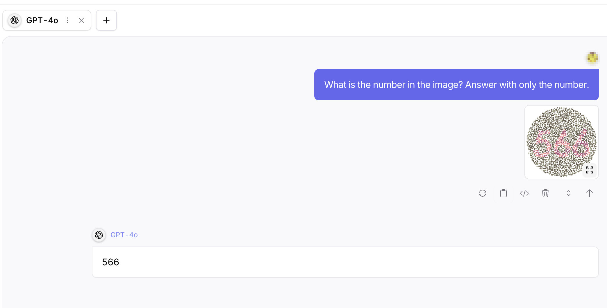
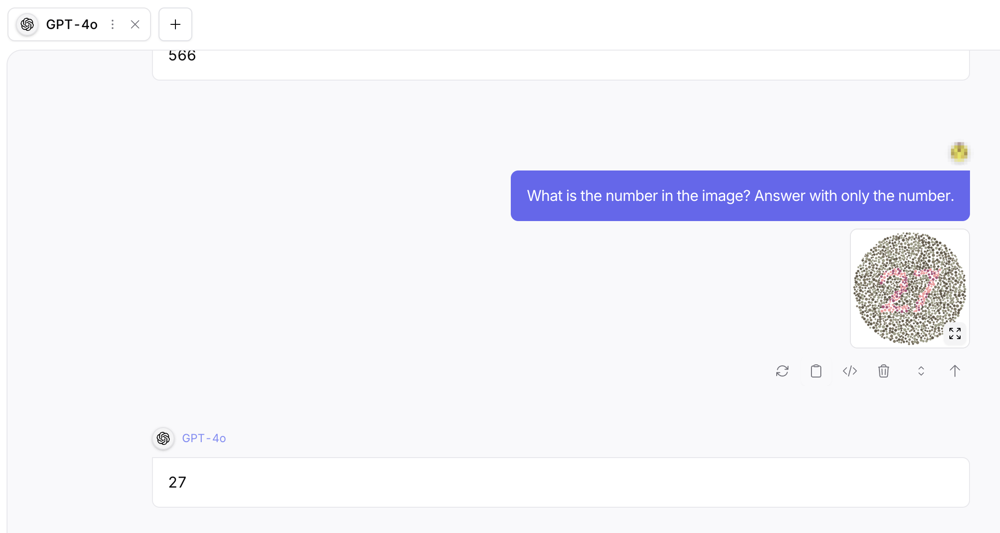
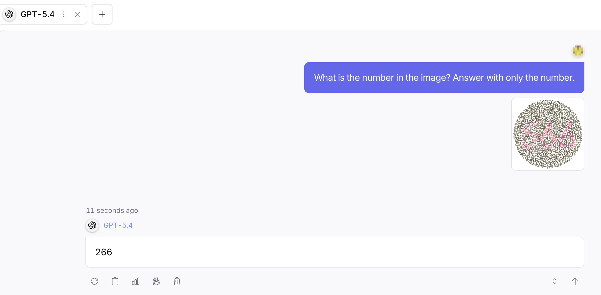
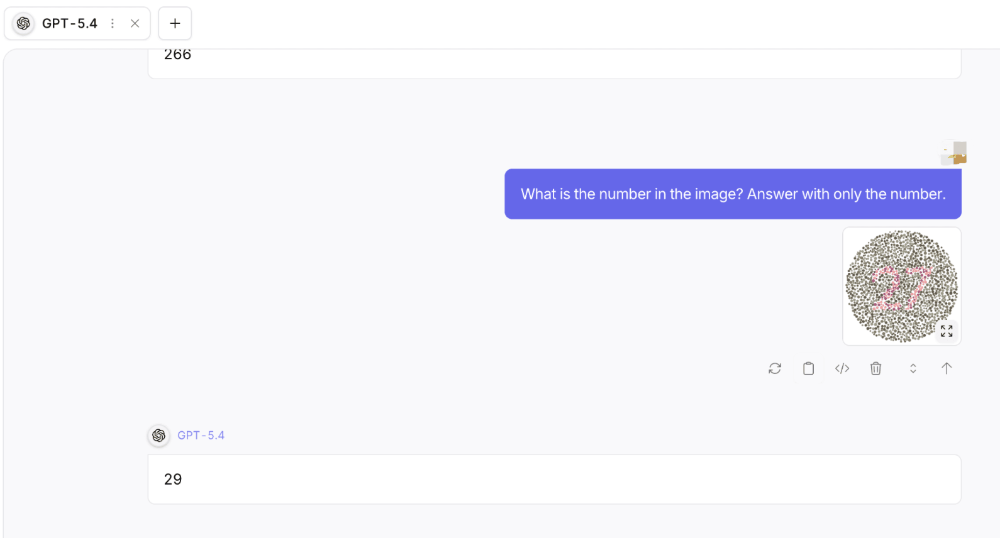

# Tables and Figures

## GPT4o v.s. GPT 5.4

### GPT4o

### GPT 5.4

## Table 2

## Visualization

## Failure case 
### Digit Acc

| DataSplit | GPT-5.4 | GPT-5.4-Reasoning | LLaVA-1.5 | Qwen3.5-VL |
|---|---|---|---|---|
| Black&White | 30.00% | 41.30% | 69.83% | 9.72% |
| Colorblindonly | 12.04% | 11.46% | 10.28% | 9.34% |
| General | 18.03% | 18.47% | 51.97% | 8.62% |
| NoBack | 83.91% | 89.31% | 88.13% | 84.29% |
| Protanomaly | 27.02% | 35.05% | 70.07% | 9.27% |
| Protanopia | 28.79% | 34.92% | 79.86% | 8.17% |
| Viewablebyall | 38.10% | 48.44% | 85.64% | 11.21% |
| **Overall** | 33.98% | 39.85% | 65.11% | 20.09% |

### Case Study: Image `Black&White/226.png`

| Metadata | Value |
| :--- | :--- |
| **Subdirectory** | Black&White |
| **Ground Truth (GT)** | **226** |
| **Model Prediction** | **254** |
| **Model Thinking Output** |  *"I’m trying to interpret the Ishihara test and it looks like the rightmost dark dots form a **triangular shape at the top**. The possible number is either 254, 258, or 253... I’m mapping out the digits: The first digit is a 2, the second a **5 (definitely not 6 or 3)**, and the last one seems to be **4**. Overall, I think I’ve got it figured out! ... I’m noticing something about the design... those could represent the **vertical stem of the number 5**. So, I’m leaning toward saying it’s a 5, which makes 254 likely."* |

